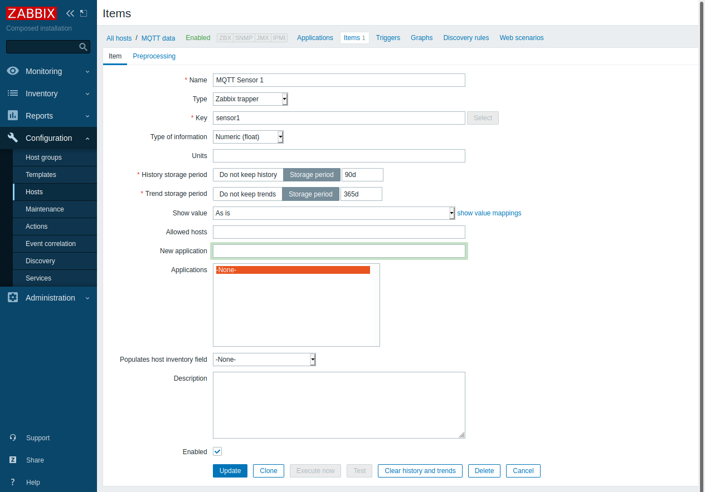

# MQTT2Zabbix

A simple, yet functional, way to integrate devices that support MQTT to your Zabbix Server.

## MQTT Broker

First, make sure you have a MQTT Broker running. [Mosquitto](https://mosquitto.org/) is recommended.

## MQTT to Zabbix

Open `Mqtt2Zabbix.py` and set the variables:
```
ZabbixServer: Zabbix server ip
ZabbixPort: Zabbix server port, default 10050
MqttServer: MQTT server ip
MqttPort: MQTT server port, default 1883
MqttUser: MQTT user
MqttPassword: MQTT password
MqttClient: MQTT client id, must be unique
```

Run `Mqtt2Zabbix` as you prefer. This script is responsible for receiving mqtt data and sending it to Zabbix server, so make sure it is running all the time.

It's recommended to run it as a service. If this is your preference, `pythonmqtt.service` is an example of configuration.

## Zabbix 

Then, make sure your Zabbix server is listening port 10050 and reachable by the broker.


Finally, add an item to your Zabbix with `Zabbix trapper` as its type.



## MQTT Client

Set your client to `publish` to the broker IP having the topic as `host_name.item_key`. The message sent will be the data collected by the Zabbix Server.
